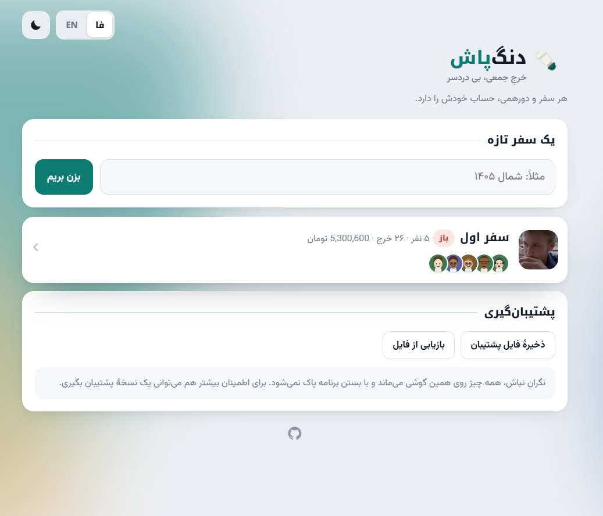
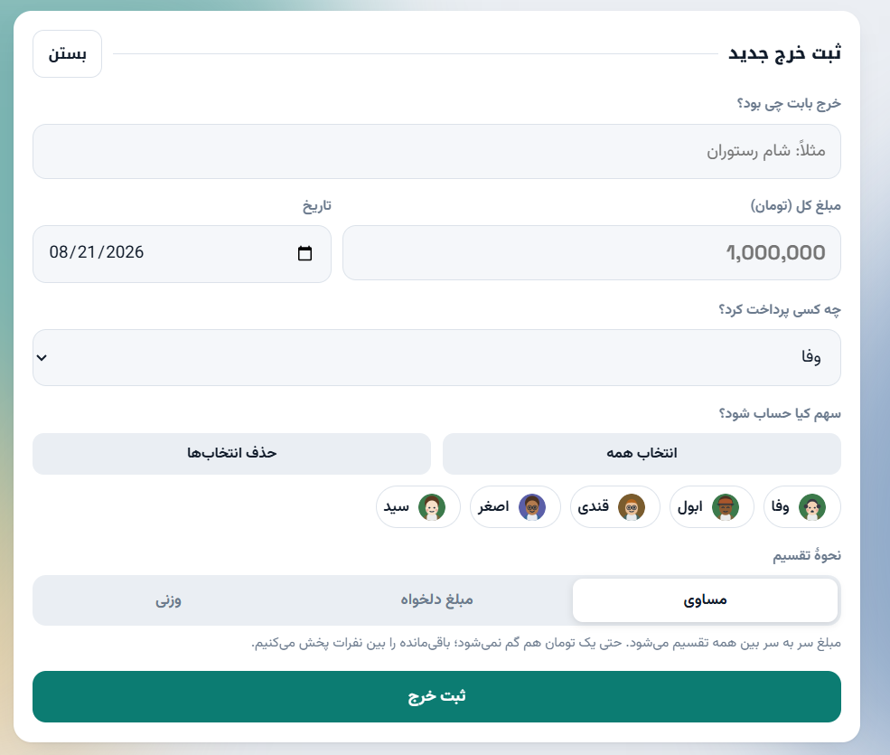
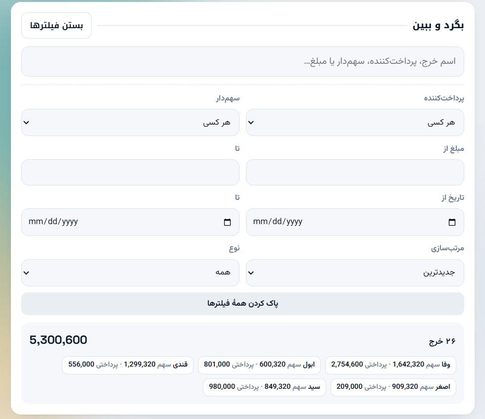
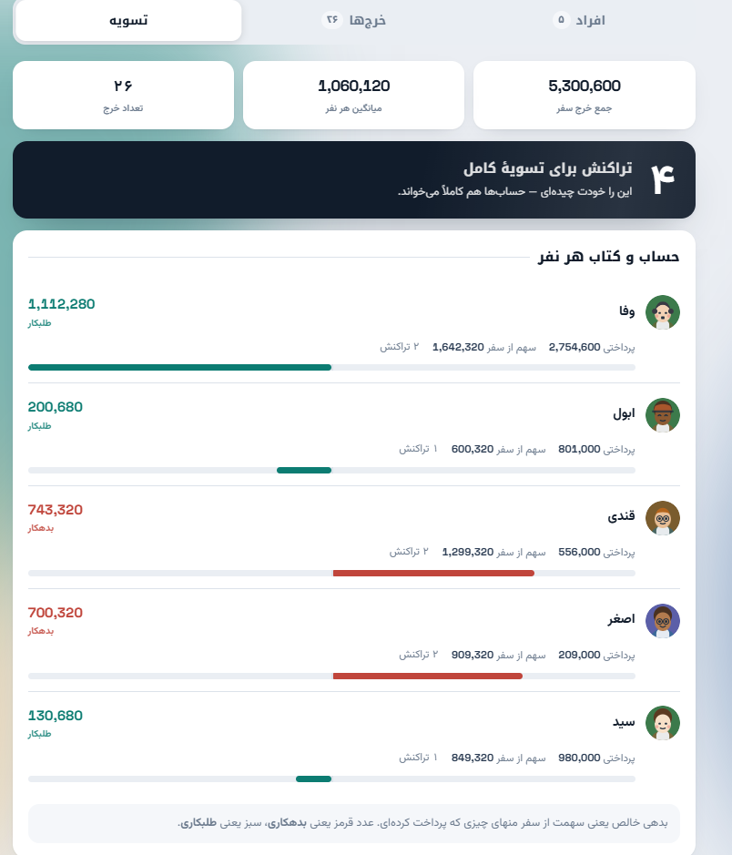
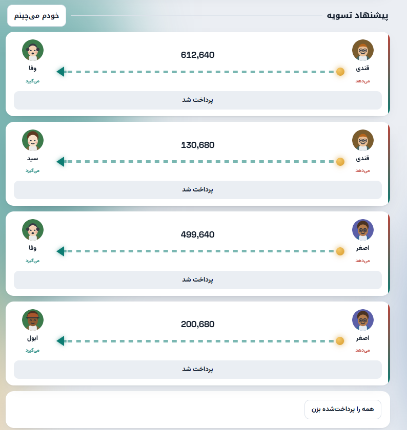
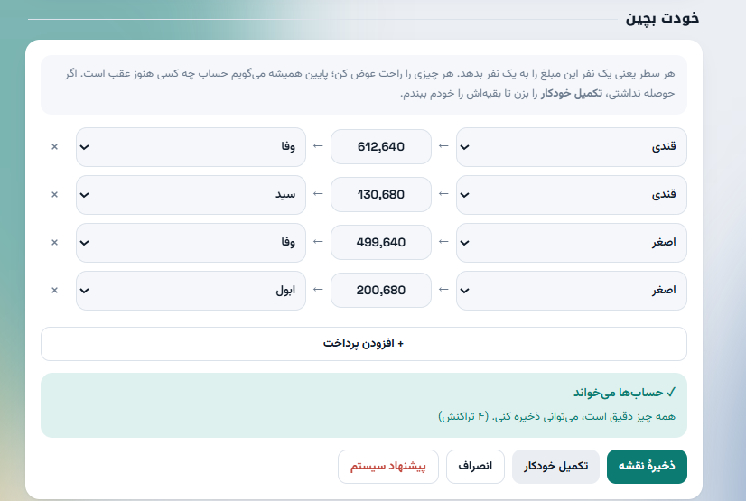
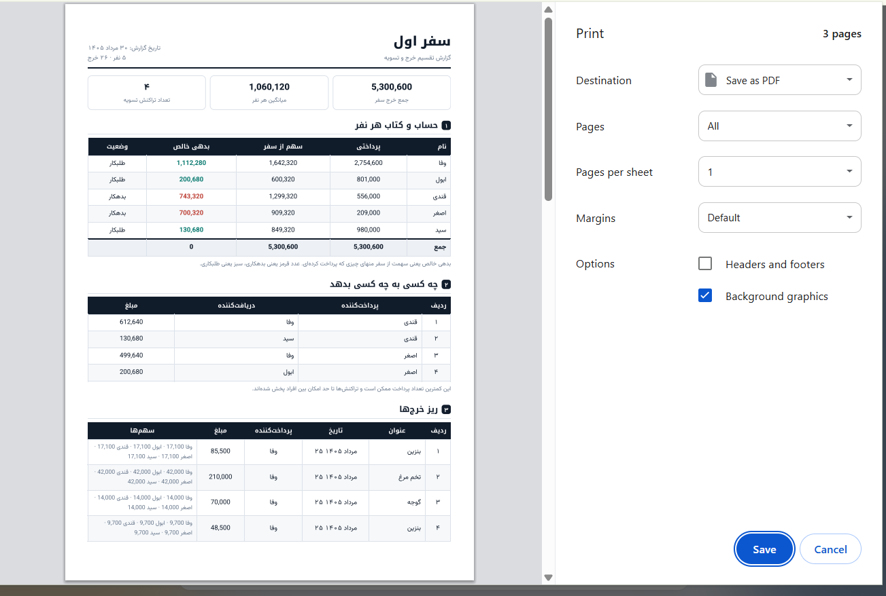

  

<h1 align="center">دنگ‌پاش</h1>

  حساب خرج جمعی را عادلانه صاف کن — با کمترین تعداد پرداخت.

  <a href="https://dong-pash.netlify.app/"><b>باز کردن برنامه</b></a> ·
  <a href="README.md">English</a>

---

آخر سفر که می‌شود، همیشه یک نفر باید بنشیند حساب کند چه کسی به چه کسی چقدر بدهکار
است. دنگ‌پاش همین کار را می‌کند: خرج‌ها را می‌گیرد، حساب هر نفر را در می‌آورد و بعد
**کمترین تعداد پرداخت ممکن** را پیدا می‌کند تا همه بی‌حساب شوند.

فرقش با یک ماشین‌حساب ساده این است که پرداخت‌ها را عادلانه هم پخش می‌کند؛ اینطور
نیست که یک نفر مجبور شود پنج بار کارت‌به‌کارت کند و بقیه هیچ.

بدون ثبت‌نام، بدون سرور، بدون ردیابی. اطلاعات روی گوشی خودت می‌ماند و جایی نمی‌رود.

## نصب

**استفادهٔ مستقیم:** <https://dong-pash.netlify.app/>

**نصب به‌عنوان اپ** (بعدش کاملاً آفلاین کار می‌کند):

| دستگاه | کاری که باید بکنی |
|---|---|
| اندروید / کروم | منوی ⋮ ← *Add to Home screen* |
| آیفون / سافاری | دکمهٔ Share ← *Add to Home Screen* |
| ویندوز / مک | آیکون نصب در نوار آدرس ← *Install* |

**اجرا روی سیستم خودت:** ریپو را کلون کن و `index.html` را با هر مرورگری باز کن؛
همین یک فایل، تمام برنامه است. اگر خواستی نسخهٔ خودت را جایی بالا بیاوری، پوشه را
روی [Netlify Drop](https://app.netlify.com/drop) بکش و رها کن یا GitHub Pages را
روشن کن. نه build لازم دارد، نه هیچ وابستگی‌ای.

## امکانات

### سفرها
هر سفر یا دورهمی، افراد و خرج‌های خودش را دارد و با بقیه قاطی نمی‌شود.

### خرج‌ها
سه جور می‌شود خرج را تقسیم کرد: **مساوی**، با **مبلغ دلخواه** برای هر نفر، یا
**وزنی** (مثلاً یکی دو برابر بقیه). باقی‌ماندهٔ گرد کردن هم بین نفرات پخش می‌شود تا
جمع سهم‌ها دقیقاً همان مبلغ کل شود.

### جست‌وجو و تحلیل
دنبال هر چیزی بگرد: اسم خرج، پرداخت‌کننده، سهم‌دار یا حتی مبلغ. فیلترها هم کامل‌اند:
پرداخت‌کننده، سهم‌دار، بازهٔ مبلغ، بازهٔ تاریخ و نوع. جالبش این است که خلاصهٔ پایین،
سهم و پرداخت هر نفر را **فقط در همان چیزی که فیلتر کرده‌ای** نشان می‌دهد.

### تسویه
اول حساب و کتاب هر نفر: چقدر داده، چقدر سهمش بوده، و ته حساب بدهکار است یا طلبکار.
بعد پرداخت‌های پیشنهادی، با فلشی که واضح نشان می‌دهد پول از کدام طرف به کدام طرف
می‌رود.

### چیدمان دستی
پیشنهاد را نپسندیدی؟ عوضش کن. مبلغ، فرستنده و گیرندهٔ هر پرداخت قابل تغییر است و
می‌توانی سطر اضافه یا کم کنی. همان لحظه پایین صفحه می‌گوید حساب چه کسی هنوز جور
نیست، دکمهٔ **تکمیل خودکار** بقیه‌اش را می‌بندد، و تا وقتی همه چیز تراز نشود اجازهٔ
ذخیره نمی‌دهد. هر وقت هم پشیمان شدی، با یک ضربه به پیشنهاد اولیه برمی‌گردی.

### خروجی
فایل اکسل با سه برگ (خلاصه، تسویه، ریز خرج‌ها) و یک گزارش A4 مرتب که می‌شود
PDF ذخیره‌اش کرد و در گروه فرستاد.

### چیزهای دیگر
- فارسی و انگلیسی، با تغییر کامل جهت صفحه
- تم روشن و تیره
- ۲۴ آواتار آماده، یا عکس دلخواه خودت؛ عکس کاور هم برای هر سفر
- اطلاعات روی دستگاه می‌ماند، به‌علاوهٔ پشتیبان‌گیری و بازیابی با فایل JSON

## الگوریتم چطور کار می‌کند

بدهی خالص هر نفر یعنی سهمش از سفر منهای چیزی که پرداخت کرده. عدد مثبت یعنی بدهکار
است، و جمع کل این عددها همیشه صفر می‌شود.

حالا باید از این اعداد به پرداخت‌ها رسید، که دو تا سؤال دارد.

**با چند پرداخت می‌شود کار را تمام کرد؟** اگر چند نفر از جمع، حسابشان بین خودشان
جور در بیاید، می‌توانند جدا تسویه کنند. یک گروه *n* نفره از این نوع، همیشه دقیقاً
*n − ۱* پرداخت لازم دارد؛ پس هر چه بتوانیم جمع را به گروه‌های بیشتری بشکنیم، تعداد
کل پرداخت‌ها کمتر می‌شود. برنامه همهٔ حالت‌های ممکن شکستن را بررسی می‌کند و آن یکی را
برمی‌دارد که بیشترین تعداد گروه را بدهد. این همان
[مسئلهٔ افراز](https://fa.wikipedia.org/wiki/%D9%85%D8%B3%D8%A6%D9%84%D9%87_%D8%A7%D9%81%D8%B1%D8%A7%D8%B2)
است که در حالت کلی NP-سخت است، ولی با
[برنامه‌ریزی پویا](https://fa.wikipedia.org/wiki/%D8%A8%D8%B1%D9%86%D8%A7%D9%85%D9%87%E2%80%8C%D8%B1%DB%8C%D8%B2%DB%8C_%D9%BE%D9%88%DB%8C%D8%A7)
روی بیت‌ماسک، برای تعداد نفرات یک سفر واقعی جواب دقیق در چند میلی‌ثانیه در می‌آید.

**حالا چه کسی به چه کسی بدهد؟** معمولاً چند چیدمان مختلف به همان حداقلِ تعداد
می‌رسند. راه‌حل بدیهی — «بزرگ‌ترین بدهکار به بزرگ‌ترین طلبکار، تکرار» — عادت دارد ته
کار همهٔ خرده‌حساب‌ها را بیندازد گردن یک بدبخت. برای همین از بین چیدمان‌هایی که
تعداد پرداختشان یکی است، آن یکی انتخاب می‌شود که پرکارترین آدمش کمترین تعداد
تراکنش را داشته باشد؛ بعد از آن هم بار را یکنواخت‌تر پخش می‌کند و از پرداخت‌های
خیلی خرد پرهیز می‌کند.

## فناوری

HTML/CSS/JS
