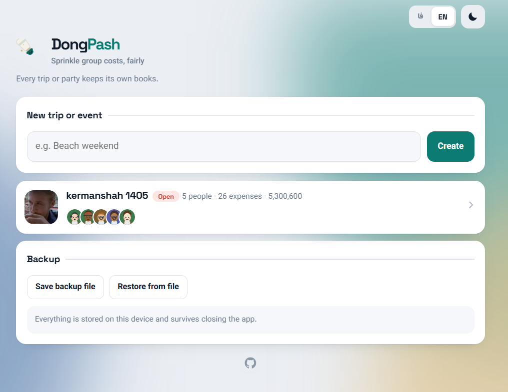
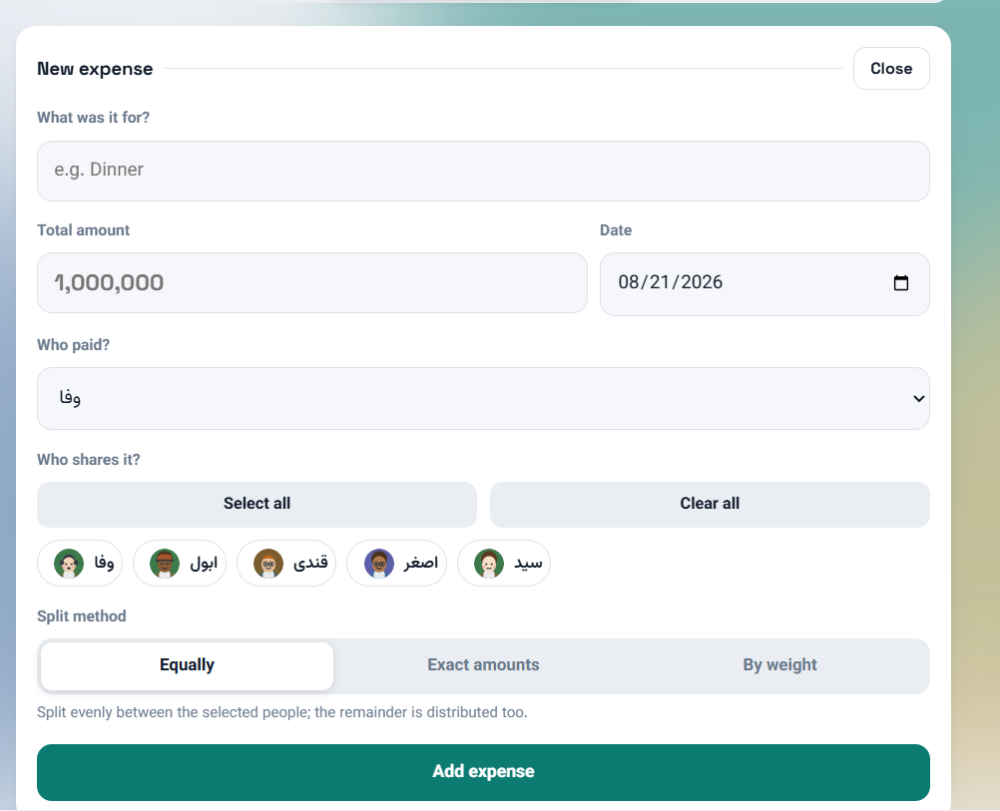
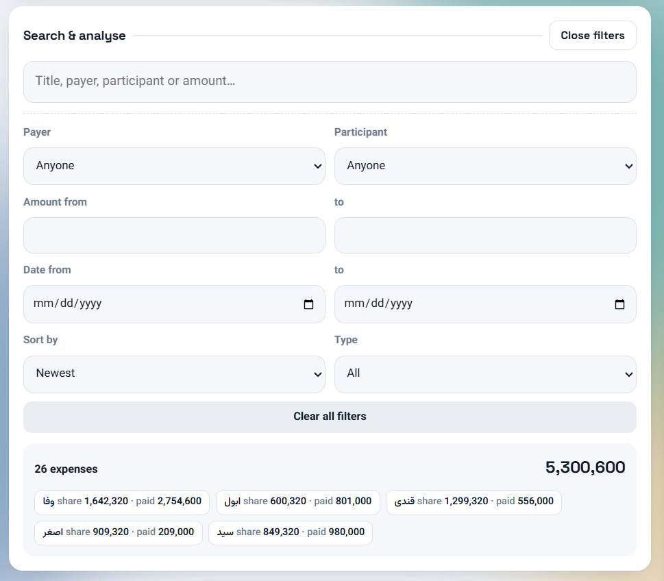
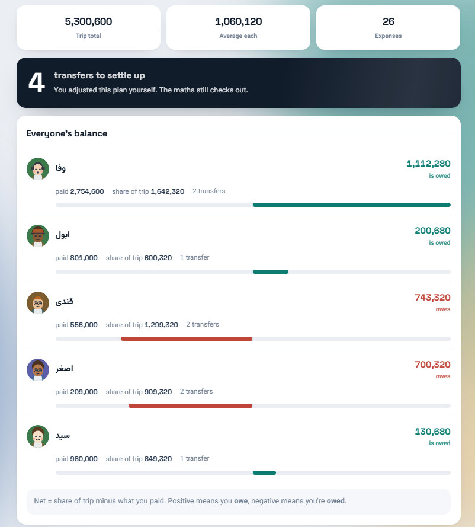
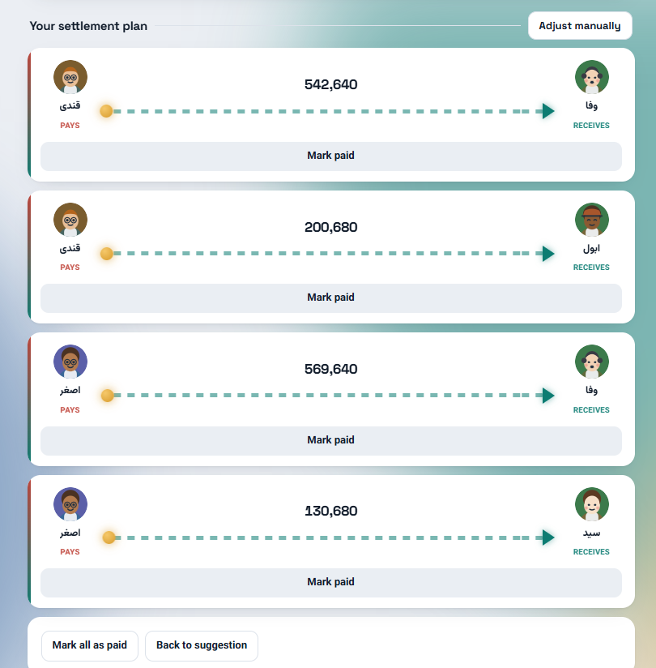
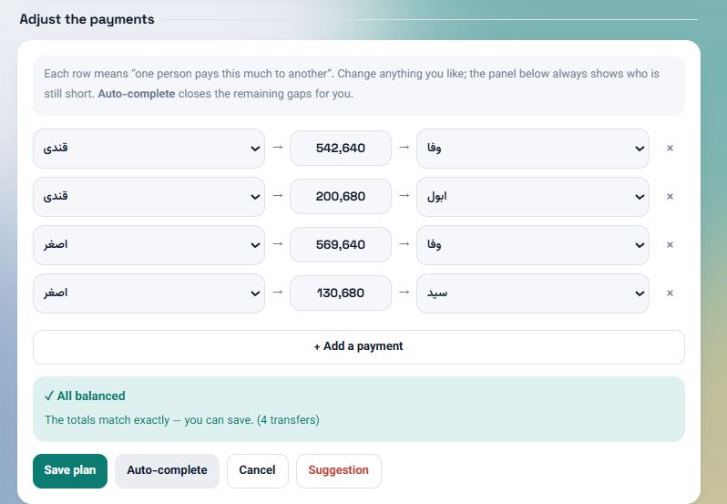
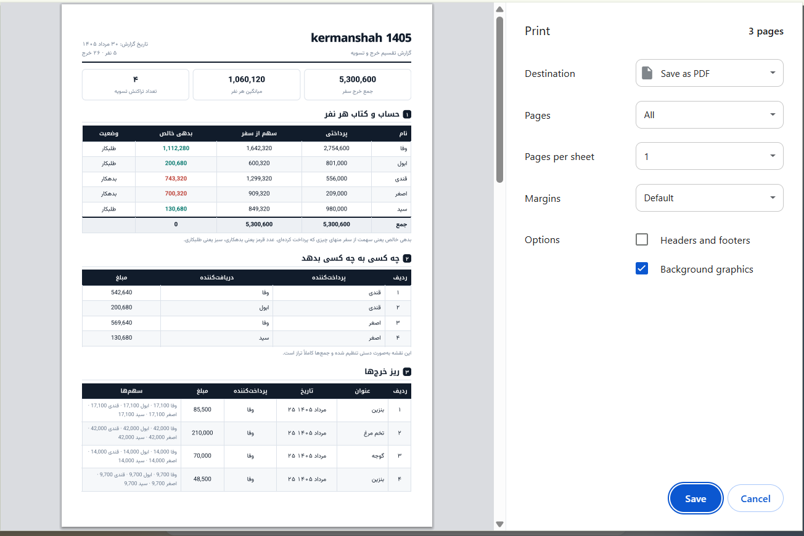

  

<h1 align="center">DongPash</h1>

  Split group expenses fairly — and settle up in the fewest possible transfers.

  <a href="https://dong-pash.netlify.app/"><b>Open the app</b></a> ·
  <a href="README.fa.md">فارسی</a>

---

A single-file, offline-first web app for splitting the cost of a trip or a party.
It works out what everyone owes, then finds the **smallest set of payments** that
settles the group — and spreads those payments as evenly as it can, so nobody ends
up making five transfers while everyone else makes none.

No account, no server, no tracking. All data stays on your device.

## Install

**Just use it:** open <https://dong-pash.netlify.app/>

**Install as an app** (works fully offline afterwards):

| Platform | How |
|---|---|
| Android / Chrome | Menu ⋮ → *Add to Home screen* |
| iOS / Safari | Share → *Add to Home Screen* |
| Windows / macOS | Install icon in the address bar → *Install* |

**Run it yourself:** clone the repo and open `index.html` in any browser — that one
file is the whole app. To host your own copy, drop the folder onto
[Netlify Drop](https://app.netlify.com/drop) or enable GitHub Pages. No build step,
no dependencies.

## Features

### Trips
Every trip or event keeps its own members and expenses.

### Expenses
Split **equally**, by **exact amounts**, or by **weight** (someone pays double).
Rounding remainders are distributed, so shares always add up to the total exactly.

### Search & analysis
Search across titles, payers and participants. Filter by payer, participant, amount
range, date range and type. The summary shows each person's share and spending
**within the current filter**.

### Settlement
Everyone's paid / share / net balance, then the suggested transfers with a clear
arrow running from payer to receiver.

### Manual adjustment
Don't like the suggestion? Change any amount, sender or receiver; add or remove rows.
A live panel shows who is still short, **Auto-complete** closes the gaps, and saving
is blocked until the maths balances. One tap returns to the suggestion.

### Export
Excel workbook (summary, settlement, itemised expenses) and a printable A4 report you
can save as PDF.

### Also
- English and Persian, with full RTL/LTR switching
- Light and dark themes
- 24 generated avatars, or upload your own photo; cover images for trips
- Data persists locally; JSON backup and restore

## How the settlement works

Each person's **net balance** is their share of the trip minus what they already paid.
Positive means they owe money; the balances always sum to zero.

Turning those balances into payments involves two questions.

**How few payments can we get away with?** If a subset of people happens to balance
out among themselves, they can settle privately. A group of *n* such people always
needs exactly *n − 1* payments, so the more of these self-contained groups you find,
the fewer payments overall. The app searches every possible way of splitting the
group and picks the one with the most subgroups. This is the
[partition problem](https://en.wikipedia.org/wiki/Partition_problem) and is NP-hard
in general, but with a
[bitmask DP](https://en.wikipedia.org/wiki/Dynamic_programming) it is exact and
instant for realistic party sizes.

**Who should pay whom?** Usually many different payment plans hit that minimum, and
the obvious greedy approach (biggest debtor pays biggest creditor, repeat) tends to
dump all the leftovers on one unlucky person. So among the plans that tie for fewest
payments, the app picks the one where the busiest person makes the fewest transfers,
breaking further ties by spreading the load evenly and avoiding awkwardly tiny
amounts.

## Tech

HTML/CSS/JS
